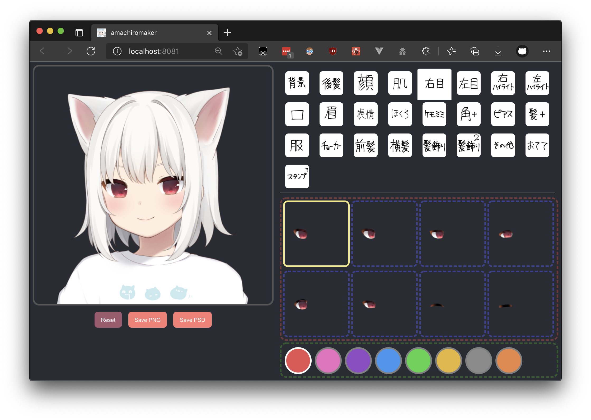
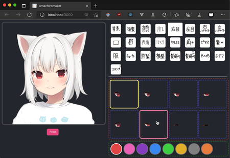

# amachiromaker-clone

I created this website since the [original one](https://picrew.me/image_maker/168503) was not accessible (as of November 2021; was taken down by its author 甘城なつき). Original website: [amachiromaker｜Picrew](https://picrew.me/image_maker/168503).

This website is not a one-to-one clone of the original one, rather it is rewritten from scratch using basic React (very lightweight, no UI library used).

**Note:** The original artwork (layers in the image) is <b><u>not</u></b> (and <b><u>will not be</u></b>) provided due to copyright reasons. You have to download them yourself (from [Wayback Machine](http://web.archive.org/) if the original website is down). I am not responsible if you violate the license.

## How to Build

Before you begin, make sure `node` (>= 14) and `yarn` are installed.

- Run `yarn` to install dependencies.
- Run `yarn build-static` to download original artworks from [Wayback Machine](http://web.archive.org/web/20210130063020/https://picrew.me/image_maker/168503)
  - By doing this, you agree that you will follow the license the license on the [original webpage (Wayback Machine copy)](http://web.archive.org/web/20210130063020/https://picrew.me/image_maker/168503) and are responsible for any consequences if you violate the license.
  - Optionally, you may use `yarn build-static -jx` to enable parallel downloads, where `x` = number of threads.
- Run `yarn start` to start development server. Your browser should open shortly.
- Or, run `yarn build ` to build the website. Static files will be located under `build/`. You can use a static file server to serve the files. Quick examples:
  - `python3 -m http.server -d build 3000` (`python3` should be installed)
  - `serve build ` (`serve` should be installed by `yarn global add serve`)

> Dockerfile/docker-compose will be added later.

## Screenshots

  
  
  
Any of the artwork above will <b><u>not</u></b> be provided in this repository.

  
Copyright of the artwork belong to the original author.

## Description of the Scripts

- `data/` JSONs from the original website, containing layer info. Scripts below will use them.
- `scripts/findDefaultCombination.js` find out the layer combination to compose the default picture.
- `scripts/findDepth.js` order the layers by depth.
- `scripts/generateMakefile.js` generate Makefile to download all the layers from Wayback Machine.
- `scripts/organizeData.js` reconsturct the original data to make it easier to use (mainly by combining image `src`s of different colors into layer objects).
