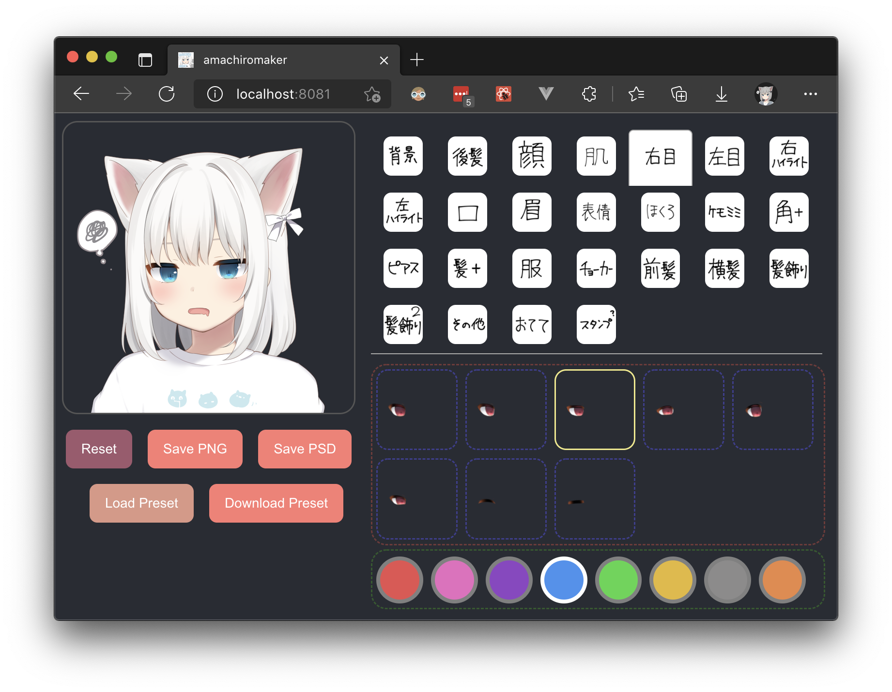
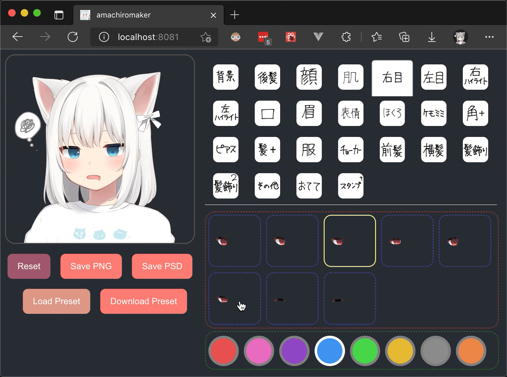

# amachiromaker

I created this website since the [original one](https://picrew.me/image_maker/168503) was not accessible (as of November 2021; was taken down by its author 甘城なつき). Original website: [amachiromaker｜Picrew](https://picrew.me/image_maker/168503).

This website is not a one-to-one clone of the original one, rather it is rewritten from scratch using basic React (very lightweight, no UI library used).

**Note:** The original artwork (layers in the image) is ***not*** (and ***will not be***) provided due to copyright reasons. You have to download them yourself, if the servers happen to be alive. I am not responsible if you violate the license.

## How to Build

### Build or Develop Locally

Before you begin, make sure `node` (>= 14), `yarn`, `GNU Make`, and `curl` are installed. Also, it is recommended to use a `bash`-compatible shell (Windows users will have problems, try WSL/MinGW/Cygwin).

> If you do not want to install all the dependencies, use Docker to build the image (next section). It should be easier.

- Run `yarn install` to install dependencies.
- Run `yarn build-static` to download original artworks. This may take a while. If it fails due to network issues, you can run it again. It will skip the files that have already been downloaded.
  - By doing this, you agree that you will follow the license on the [original webpage](https://picrew.me/image_maker/168503) and are responsible for any consequences if you violate the license.
  - Optionally, you may use `yarn build-static -jx` to enable parallel downloads, where `x` = number of threads (preferably `4`, setting it too high will cause the server to throttle you).
- Run `yarn start` to start development server. Your browser should open shortly.

If you want to build the website, run `yarn build` to build the website. Static files will be located under `build/`. Use any static file server to serve the directory. For development purposes, you can use `python3 -m http.server` to serve the directory on port 8000. For production, you can use `nginx` (example configuration is in `nginx.conf`) or `caddy` to serve the directory.

### Build Docker Image

Make sure `docker` is installed. You can follow the instructions [here](https://docs.docker.com/get-docker/).

Just run `docker build . -t charlie0129/amachiromaker` to build the production-ready image. It will take a while to download all the artworks for you if you haven't done it in the previous section. If the download constantly fails due to network issues, you can download the artworks manually (`yarn build-static -j2`) before running the Docker build command. The downloaded files will be copied into the image, thus reducing the build time.

You can then run `docker run --rm -it -p 8000:80 charlie0129/amachiromaker` to start the server (Port 8000 can be changed to whatever you want). The website will be available at `http://localhost:8000/`.

## Features

- Choose any combinations you want, with live preview.
- Auto save. Your changes will be preserved between page reloads.
- Download output image as `PNG` or `PSD` (with all the separate layers you can fiddle with).
- Download raw layer combination presets. You can load the preset and make changes to it later.

  <figure>
    
    <figcaption>Fig.1 - Screenshot</figcaption>
  </figure>
  <figure>
    
    <figcaption>Fig.2 - Animated GIF</figcaption>
  </figure>
  <figure>
    
    <figcaption>Fig.3 - PSD Layers</figcaption>
  </figure>
  
Any of the artwork above will <b><i>not</i></b> be provided in this repository.

  
Copyright of the artwork belongs to the original author.

## Description of the Scripts

> Generally, you will **not** need to use these scripts. They will be executed automatically when generating static files.

- `scripts/data/` JSONs from the original website, containing layer info. Scripts below will use them.
- `scripts/findDefaultCombination.js` find out the layer combination to compose the default picture.
- `scripts/findDepth.js` order the layers by depth.
- `scripts/generateMakefile.js` generate Makefile to download all the layers from picrew CDN.
- `scripts/organizeData.js` reconstruct the original data to make it easier to use (mainly by combining image `src`s of different colors into layer objects).

#### If you find this project interesting, stars⭐️ are appreciated.
