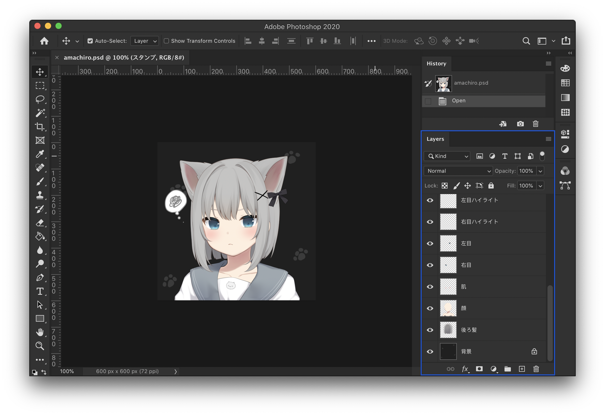

# amachiromaker

I created this website since the [original one](https://picrew.me/image_maker/168503) (I really like it) was not accessible (as of November 2021; was taken down by its author 甘城なつき). Original website: [amachiromaker｜Picrew](https://picrew.me/image_maker/168503).

This website is not a one-to-one clone of the original one, rather it is rewritten from scratch using basic React (very lightweight, no UI library used).

**Note:** The original artwork (layers in the image) is ***not*** (and ***will not be***) provided due to copyright reasons. You have to download them yourself (from [Wayback Machine](http://web.archive.org/) if the original website is down). I am not responsible if you violate the license.

## How to Build

### Build or Develop Locally

Before you begin, make sure `node` (>= 14), `yarn`, `GNU Make`, and `curl` are installed. Also, it is recommended to use a `bash`-compatible shell (try WSL/MinGW/Cygwin if you run into problems under Windows).

> If you do not want to install all the dependencies, use Docker to build the image (next section). You can extract build artifacts from `build/`.

- Run `yarn install` to install dependencies.
- Run `yarn build-static` to download original artworks from [Wayback Machine](http://web.archive.org/web/20210130063020/https://picrew.me/image_maker/168503)
  - By doing this, you agree that you will follow the license on the [original webpage (Wayback Machine copy)](http://web.archive.org/web/20210130063020/https://picrew.me/image_maker/168503) and are responsible for any consequences if you violate the license.
  - Optionally, you may use `yarn build-static -jx` to enable parallel downloads, where `x` = number of threads.
  - It will not work if you are using a shell that is not compatible with `bash` syntax.
- Run `yarn start` to start development server. Your browser should open shortly.
- Or, run `yarn build` to build the website. Static files will be located under `build/`.

### Build Docker Image

Just run `docker build . -t charlie0129/amachiromaker` to build the image.

## How to Deploy

You have two options to deploy this application. Choose the one you like.

### Containerized

1. Make sure `docker` and `docker-compose` are installed and updated.
2. Copy `.env` as `.env.local`. This is your configuration file.
3. Depending on whether you want to have `traefik` as a reverse proxy, you have two options:
    1. No `traefik`: `./runner.sh start prod -v -d ` (listens on `PORT` in `.env.local`, defaults to `8081`)
    2. With `traefik`: `./runner.sh start prod-traefik -v -d` (you need to configure `traefik` yourself. remember to check the `traefik` configurations in `docker-compose.traefik.yml` and `WEBSITE_URL` in `.env.local`)

> If you wonder what the heck is `./runner.sh`, you can find it [here (charlie0129/server-app-runner)](https://github.com/charlie0129/server-app-runner) .

### Other

If you do not have Docker, try using a static file server to serve the `build/` directory (after you successfully built the project).

Quick examples:

- `python3 -m http.server -d build 3000` (`python3` should be installed)
- `serve build ` (`serve` should be installed by `yarn global add serve`)

Preferably:

- `nginx` (example configuration is in [`nginx.conf`](https://github.com/charlie0129/amachiromaker/blob/master/nginx.conf))

## Feature

- Choose any combinations you want, with live preview.
- Auto save. Your changes will be preserved between page reloads.
- Download output image as `PNG` or `PSD` (with all the separate layers you can fiddle with).
- Download raw layer combination presets. You can load the preset and make changes to it later.

  <figure>
  	
  	<figcaption>Fig.1 - Screenshot</figcaption>
	</figure>
  <figure>
  	
  	<figcaption>Fig.2 - Animated GIF</figcaption>
	</figure>
  <figure>
  	
  	<figcaption>Fig.3 - PSD Layers</figcaption>
	</figure>
  
Any of the artwork above will <b><i>not</i></b> be provided in this repository.

  
Copyright of the artwork belongs to the original author.

## Description of the Scripts

- `data/` JSONs from the original website, containing layer info. Scripts below will use them.
- `scripts/findDefaultCombination.js` find out the layer combination to compose the default picture.
- `scripts/findDepth.js` order the layers by depth.
- `scripts/generateMakefile.js` generate Makefile to download all the layers from Wayback Machine.
- `scripts/organizeData.js` reconstruct the original data to make it easier to use (mainly by combining image `src`s of different colors into layer objects).

> If you find this project interesting, stars are appreciated.
